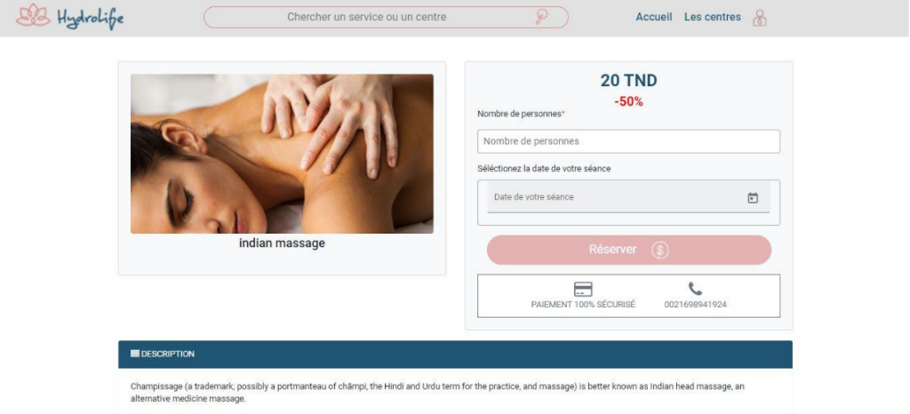

# HydroLife

Hydrolife is a web application that allows users to easily book appointments with hydrotherapy professionals. This project was developed using Angular and Spring Boot, here's a link to the the [backend](https://github.com/safa-abidi/hydrolife-back-end/).  

 

## Features
The goal of Hydrolife is to provide a user-friendly interface for individuals seeking hydrotherapy services. Users can search for hydrotherapy professionals based on location and specialty, view their availability, and book appointments. Additionally, hydrotherapy professionals can create an account to add their information and services, manage their availability, and view their appointment history.  

  

## Installation & Usage
- Clone the project 
- Install dependencies by running ``npm install``  
- Start the application by running ``ng serve -o``
